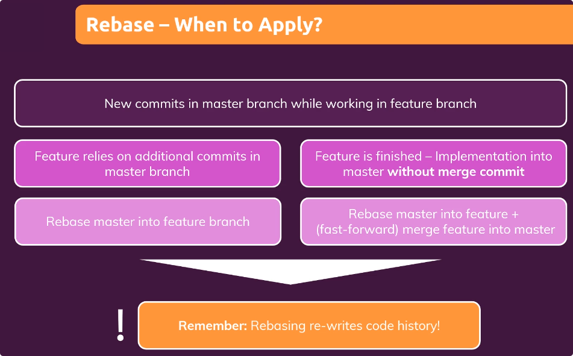
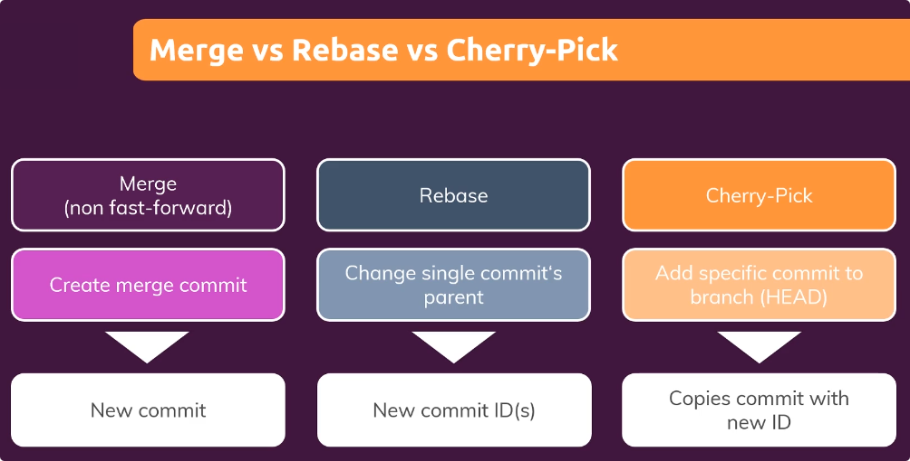
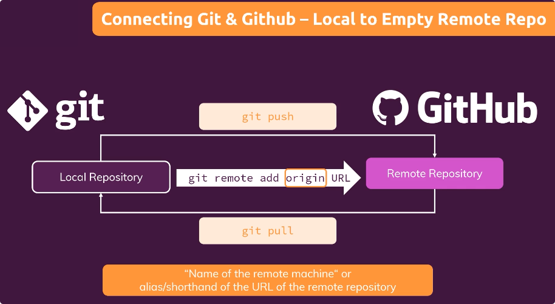

# What is git?
Git is a free and open source distributed version control system designed to handle everything from small to very large projects with speed and efficiency.

## What is a version control system?
* It allows us to save many versions of a same proyect using checkpoint
* It save us memory
* It comes to solve the problem of saving multiple files for one proyect to have checkpoints

## Git disadvantages
* It works locally. Meaning that working in a group project just with git unpractical.
* If we lose or damage the computer where the project is we can lose all the change log.

# What is github?
* Is the largest development platform
* It's a Cloud Hosting & collaboration provider
* It is a git repository hosting
* It come to solve the git's problems

Github and Git aren't the same thing, but they complement each other

# How does it work?
Whenever we use git, it is created a working directory and a hidden folder called __.git__ , where the version control system works.

More information [here](https://medium.com/hackernoon/understanding-git-index-4821a0765cf)

## Basic concepts
* Working directory: Folder where git is managed
* Commit: files and folder snapshot. It registers the changes
* Branch: Order set of commits

# Git instalation
Check [website](https://git-scm.com/)

# Git basic commands
* **git init**: To initialize repository
* **git status**: Gives a description about the project files and the current branch. It also give us information about the current folder files, if they are in the worging directory or the staging area
* **git add file_name**: It add file_name to the staging area. If we use a point (__.__) instead of a file name, it adds all the current folder files to the staging area 
* **git commit -m "message"**: Moves files from staging area to the repository with an attached massage
* **git config --global user.email "email"**: It allow us to configure with which mail we identify ourself inside git
* **git config --global user.name "name"**: It allow us to configure with which name we identify ourself inside git
* **git config user.email**: It gives us the current user's mail
* **git config user.name**: It gives us the current user's name
* **git log**: It give us information about all the logs of the current branch
* **git checkout commitId_or_branch**: It allow us to restore to a previous version or to move to other branch
* **git branch**: It give us the names of all branches
* **git branch new_branch_name**: It creates another branch
* **git checkout -b new_branch_name**: It create a new branch and move the head to it.
* **git merge other_branch**: It adds all the changes of other_branch to the current branch
* **git switch branch_name**:  To creat a move to other branch
* **git switch -c branch_name**:  To create a new branch.
* **git ls-files**: To see files that are considered in the current branch for, at least, the staging area
* **git add**: Remove from stage area all the files deleted in the working directory

## Delete data
* **git rm file_name**: To delete file from staging area (It should have been deleted from the working directory too)
* **git clean -d**: To delete unstaged files from working directory
* **git clean -df**: To delete unstaged files from working directory
* **git clean -dn**: To show unstaged files from working directory and the computer

## Untrack change from staging area to latest commit
* In the working directory for one file: You can just to the latest commit state for an specific file by using the command: **git checkout file_name** or **git restore file_name**
* In the working directory for multiple files: **git checkout** or **git restore .**

## Restore untracked files
Just use __git clean -df__

## Untrack change from staging area
**git reset file_name**: It doesn't errase anything, it just move it from staging area to the work directory

## Undo commits
* **git reset --soft HEAD~1**: This undo 1 commit from the branch, returning all changes done to the staging area
* **git reset HEAD~1**: This undo 1 commit from the branch, returning all changes done to the working directory
* **git reset --hard HEAD~1**: This undo 1 commit from the branch, returning 1 commit back erasing any change done.

## Remove branches we don't need any more
* Just one banch: **git branch -D branch_name**
* Multiple branch: **git branch -D branch_name1 branch_name2**
You can delete a branch when there is no more need of it

# Head
* Head: Last commit we are pointing
* Detahced Head: Special branch that is created when we switch move the head to an specific commit. This special branch is erased whenever we change branch, the only way to save it is to create a new branch

# Detached Head mode
Each commit always has its id. When we move the head to previous commits and we add other commit, it is generated a special id.

When we switch from this branch to other we want to know this id, so we can generate other branch (if we want). To generate this new branch we use the command: **git branch new_branch_name detached _head_commit_id**

# .gitignore
* To ignore one file just write in one line its name. For instance, **text.log**
* To ignore files with a particular type just taling into account it type. For example: __*.log__. To make an exeption you can specify the files by using the next sintaxis: __!exception.log__

# stash
A place where we can save uncommitted and/or unstaged progress.
* **git stash**: To save the uncommitted and/or unstaged progress and rebuild the project to the latest commit state
* **git stash apply**: To rebuild the stash
* __git stash push -m "message"__: Add changes with comments into the stash
* __git stash save "message"__: Add changes with comments into the stash
* **git stash pop stash_index**: To commit a specific stash state and removed from the stash list
* **git stash drop stash_index**: Drop a specific stash checkpoint
* **git stash drop clear**: Drop all the stash checkpoints

## stash motivation
Whenever we change from one branch to other we lose the staging area data.

When we are working in multiple branches we may need to do the same change for 2 branches.

For example, adding the same new file. We create and write the file in one of those branches. Then, we can
1. Copy the file, change to the other branch and paste the file in it. And if we change this file here to we need to do the same to move the changes to the other branch.
1. Use the stash, change the branch, get stash and now we have the same file for both branches. This without adding it to the stage in any of the two branches. We can work on this stasg node, modify it and be able to use the same file in both branches.
Source: https://www.quora.com/Whats-the-difference-between-git-stash-and-git-stage

# Restore deleted commits
* **git reflog**: command to see all the the changes done during last 30 days, even those deleted commits. You can use the id provided to reset the branch just by using the command __git reset --hard reflog_id__

# Merge Types
First clasification:
* Fast-Forward: When there are no additional commit in the master branch (after feature franch was created)
* Non Fast-Forward

Non Fast-Forward clasification:
* Recursive
* Octopus
* Ours
* Subtree

Most common types are Fast-Forward and Non Fast-Forward Recursive merge.

## Fast-forward merge
Merge moves HEAD forward but doesn't create new commit. We can say that the branch that call the merge is just updated.

The command __git merge --squash branch_name__ allow us to group all the extra commits from branch_name to the stagging area of the current branch to make one single commit

## Non Fast-Forward recursive merge

* There are additional commits in the current branch and the branch we are trying to merge after this branch was created.
* An additional (merge) commit is cqreated in the current branch
* __git merge --no-ff branch_name__

# Rebasing

Adding commits from other branch to de current branch. The result will be almost similar to a non fast-forward recursive merge. What happens is that we don't move de commits, we create new ones that are similar but with different ids. We shouldn't rebase commit outside our repository. Commands:
* **git rebase other_branch**

## When to apply rebase?

# Merge conflicts
They usually happen when we work on the same file in different branches. When this occurs, we can:
* Accept current change: Accept the change that happened in the current branch
* Accept incoming change: Accept the change that happened in the incoming branch
* Accept both changes
* __git diff__: To see differences in both version of the merged branches

# Cherry-pick

Use command **git cherry-pick commit-id** to add specific change (commit) in the current branch (this can come from any other branch). This will do a copy of the specific commit, meaning it will have a different commit id from the original

# Git tag
Useful to identify specific commits. It give an alias to a commit. Commands:
* **git tag**: give all the tags from the project
* **git tag tag_name_or_number**: It adds a tag refering to the current commit
* **git tag tag_name_or_number commit_hash**: It adds a tag refering to the specified commit
* **git show tag_name_or_number**: 
* **git tag -d tag_name_or_number**: delete a tag
* **git tag -a tag_name_or_number -m message**: It creates and add a message to a tag

# Github

## How to create a new remote repository on github?
From github, your repositories, new repository

## Github/git commands
* **git remote add remote_repo_name URL**: To link the current local repository to a remote repository. The *remote_repo_name* is just an internal alias for the URL. Usually this name is origin.
* **git branch -M new_branch_name**: To rename the current branch
* **git push -u remote_repo_name_or_URL branch_name**: Bring local changes to the remote repository. If the *branch_name* doesn't exists, it will be created.
* **git pull**